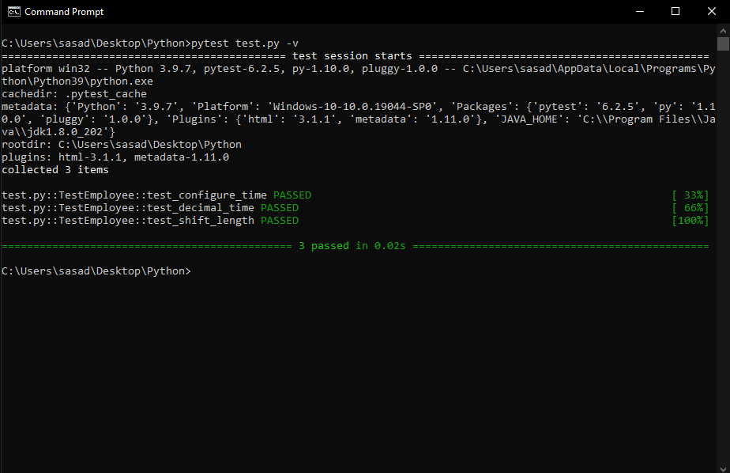

# clockIn_clockOut_tracker

<strong>About</strong> 
- This program is a simplified version of the electronic trackers that record employee hours
- Infinite while loop was used to achive constant "up time" for this tracker 
- To keep program simple, instead of employee IDs (given to employees when they are hired) the program uses employee names
- When the name is entered, the program stores the name and the time employee clocked in to work
- If the same name is entered again, the program will clock out the employee and issue them a time card with the hours worked in decimal time 

<strong>SCREENSHOTS</strong>

